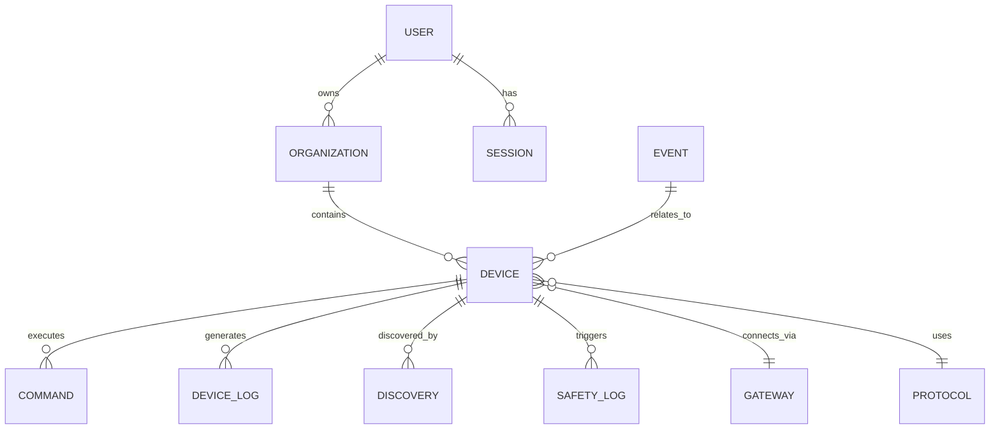

### 🌐 KSV

# KSV — Project Documentation (Organized & De-duplicated)

---

## 1. KSV Mission & Core Principles
KSV គឺជា Universal Secure Control Platform អន្តរជាតិ សម្រាប់គ្រប់គ្រង និងបញ្ជាឧបករណ៍អេឡិចត្រូនិកគ្រប់ប្រភេទ (ផ្ទះ អគារ រថយន្ត ឃ្លាំង រោងចក្រ) តាមរយៈ interface ដែលមានការអនុញ្ញាតត្រឹមត្រូវប៉ុណ្ណោះ។

គោលការណ៍ស្នូល៖
- Security First
- Privacy First
- Safety First
- Authorization First
- Device Ownership
- Least Privilege
- No Unauthorized Control
- Every Important Action Is Auditable
- Fail Securely
- International by Design

> **គោលការណ៍មូលដ្ឋាន:** A user may discover a device, but discovery never means authorization.

KSV មិនត្រូវបានរចនាឡើងសម្រាប់ hack ឬចូលប្រើប្រាស់ដោយគ្មានការអនុញ្ញាតឡើយ។ វាជាស្ពានសុវត្ថិភាពរវាងអ្នកប្រើប្រាស់ដែលមានការអនុញ្ញាត និងបច្ចេកវិទ្យាដែលត្រូវគ្នា។

---

## 2. Global Platform Layer
ស្រទាប់ខាងលើបំផុតរបស់ KSV ត្រូវគ្រប់គ្រង៖
Global platform identity, Global configuration, Countries, Regions, Languages, Time zones, Currencies, Regional settings, Service availability, Global policies, Platform status.

---

## 3. Identity System
"អ្នកណា?" — គ្រប់គ្រងគណនី KSV របស់អ្នកប្រើប្រាស់៖
- KSV Account, User ID
- Email / Phone identity
- Google / Facebook / TikTok / Identity Providers ផ្សេងទៀត
- Account linking / unlinking
- Identity verification
- Account status, suspension, deletion

**គោលការណ៍:** One KSV Account → Multiple Verified Identities.
KSV ត្រូវបំបែក user identity ចេញពី authentication provider ហើយមិនត្រូវទាមទារ password ខាងក្រៅរបស់អ្នកប្រើប្រាស់ឡើយ។

---

## 4. Authentication System
"តើអ្នកណាកំពុង Login?" — ត្រូវមាន៖
Password authentication, Secure password hashing, MFA, Email/Phone verification, OTP, Session management, Refresh tokens, Login history, Failed-login protection, Brute-force protection, Suspicious-login detection, Device/session revocation.

---

## 5. Password Privacy (គោលការណ៍សំខាន់)
- KSV administrators មិនត្រូវមានសិទ្ធិមើល password ដើមរបស់អ្នកប្រើប្រាស់ជាដាច់ខាត — សូម្បីតែក្នុង dashboard, logs, API, database ក៏ដោយ។
- ការបែងចែកទំនួលខុសត្រូវ៖ **Platform Owner ≠ System Administrator ≠ User**
  - User Password → User-controlled secret
  - Platform secrets → KSV-controlled secrets
  - Device credentials → Device/Owner-controlled credentials
- សម្រាប់ Identity Provider ខាងក្រៅ ត្រូវប្រើ OAuth 2.0 / OpenID Connect មិនមែនប្រមូល password ដោយផ្ទាល់ទេ។

---

## 6. Account Recovery
- Forgot Password → ផ្ទៀងផ្ទាត់អត្តសញ្ញាណតាម Email / Phone / Identity Provider / MFA / OTP
- លេខកូដ 6-ខ្ទង់ (OTP) ត្រូវ៖ ផុតកំណត់លឿន, ប្រើបានតែម្តង, កំណត់ចំនួនព្យាយាម, ការពារ brute-force
- លទ្ធផលនៃការសង្គ្រោះគណនីគឺការបង្កើត **password ថ្មី** មិនមែនបង្ហាញ password ចាស់ឡើយ
- ត្រូវ revoke session ចាស់ៗបន្ទាប់ពី recovery ជោគជ័យ

---

## 7. Authorization System
Authentication = "អ្នកណា", Authorization = "អាចធ្វើអ្វីបាន" — ត្រូវបំបែកជាពីរប្រព័ន្ធដាច់ដោយឡែក។

កម្រិតសិទ្ធិដែលអាចមាន៖ Owner, Super Administrator, Organization Administrator, Manager, Operator, Controller, Viewer, Guest, Temporary Permission។

គោលការណ៍ត្រូវឆ្លើយសំណួរ៖
**Who + What + Which Device + Where + When + Under What Conditions**
(ឧទាហរណ៍៖ Operator អាចបើកម៉ាស៊ីន A បានតែម៉ោង 8AM–5PM និងតែនៅ Factory A — នេះហៅថា Policy-Based Access Control)

ត្រូវមានផងដែរ៖ Permission expiration, Permission revocation, Approval workflow។

---

## 8. Organization & Enterprise System
រចនាសម្ព័ន្ធសម្រាប់ក្រុមហ៊ុន/សហគ្រាស៖
```
Organization
 ├── Users
 ├── Roles
 ├── Sites
 │    ├── Buildings
 │    ├── Rooms
 │    └── Devices
 ├── Policies
 └── Audit
```
ត្រូវមាន៖ Organization, Company, Department, Site, Building, Room/Zone, Team, Employee, Organization roles, Organization policies។

---

## 9. Device Identity
KSV ត្រូវស្គាល់ព័ត៌មានឧបករណ៍នីមួយៗឱ្យច្បាស់៖
Device ID, Manufacturer, Brand, Model, Serial number, Device type, Firmware/Hardware version, Device owner, Organization owner, Device status, Device capabilities, Device security state។

---

## 10. Device Capability System
KSV មិនគួរដឹងតែថា "នេះជាទូរទស្សន៍" ប៉ុណ្ណោះទេ — ត្រូវដឹងថា **វាអាចធ្វើអ្វីបានខ្លះ** (Power, Volume, Channel, Input, Display, Network...)។ នេះជា Device Capability System ដែលកំណត់ថា action មួយណាត្រូវការសិទ្ធិកម្រិតខ្ពស់ជាងគេ។

---

## 11. Device Discovery
ស្វែងរកឧបករណ៍តាម៖ Bluetooth, Wi-Fi, Local Network, QR, NFC, Manufacturer discovery, Cloud/Gateway-connected devices។

> **គោលការណ៍:** Discovery ≠ Permission — ការរកឃើញឧបករណ៍មិនមែនមានន័យថាមានសិទ្ធិបញ្ជាវាឡើយ។

---

## 12. Device Pairing
លំដាប់ត្រឹមត្រូវ៖
```
SCAN → DEVICE FOUND → IDENTITY VERIFIED → OWNER VERIFIED
→ PAIRING → PERMISSION → SECURE CONNECTION → READY
```
វិធីផ្ទៀងផ្ទាត់៖ Device codes, QR codes, PINs, Secure pairing procedures, Manufacturer credentials, Certificates/cryptographic keys, Owner approval។ ត្រូវអាច Unpair, Re-pair, Revoke ផងដែរ។

---

## 13. Device Ownership
ឧបករណ៍អាចជាកម្មសិទ្ធិរបស់៖ Individual, Family, Company, Building, Warehouse, Factory ឬអង្គភាពដែលមានការអនុញ្ញាតផ្សេងទៀត។ ម្ចាស់អាច grant, modify, revoke សិទ្ធិបានគ្រប់ពេល រួមទាំង Ownership transfer និង Permission delegation។

---

## 14. Universal Protocol Layer
ស្រទាប់បកប្រែរវាង KSV និងឧបករណ៍ (មិនបង្ខំគ្រប់ឧបករណ៍ឱ្យប្រើ protocol ដូចគ្នា)៖
```
KSV Command → Protocol Adapter → Bluetooth / Wi-Fi / API / MQTT / IR → Manufacturer Device
```
ត្រូវរៀបជាស្រទាប់៖ Device Type → Manufacturer → Protocol → Authentication → Authorization → Command។ នេះជាមូលដ្ឋានដែលធ្វើឱ្យ "Universal Control" អាចកើតឡើងបាន ដោយមិនចាំបាច់ពឹងលើក្រុមហ៊ុនតែមួយ (Sony, Samsung, LG, JBL, Panasonic...)។

---

## 15. KSV Gateway / Edge System
សម្រាប់ឧបករណ៍ដែលមិនអាចភ្ជាប់ Cloud ដោយផ្ទាល់ (ក្នុងផ្ទះ រោងចក្រ ឃ្លាំង)៖
```
KSV Cloud → KSV Gateway → Local Network (Bluetooth / IR / Wi-Fi / MQTT / Local Devices)
```
Gateway ជាស្ពាន មិនមែនជា Security bypass ទេ។ វាជួយសម្រាប់ local automation, offline operation, local discovery, local security។

---

## 16. Command Engine
Flow ត្រឹមត្រូវសម្រាប់ការបញ្ជាឧបករណ៍៖
```
User Command → Authentication → Authorization → Device Capability
→ Safety Policy → Execute → Result → Audit
```
ត្រូវមាន៖ Command parser, validation, capability check, permission check, safety check, execution, error handling, timeout, retry policy។

---

## 17. AI Command Layer
ប្រសិនបើអនុញ្ញាតឱ្យ User និយាយភាសាធម្មតា ("Turn on the living room fan"):
```
Natural Language → AI Interpretation → Structured Command
→ Authorization → Safety → Execution
```
AI មានតួនាទីត្រឹមតែ **បកស្រាយ** ប៉ុណ្ណោះ មិនមែនជាអ្នករំលង Security ឡើយ។

---

## 18. Automation Engine
ក្រោយពី Manual Control ធ្វើការបានស្ថិតស្ថេរ អាចបន្ថែម logic ប្រភេទ IF-THEN (Time-based, Sensor-based, Location-based, Device-state-based, Schedule, Event-based)។ Automation ត្រូវឆ្លងកាត់ Permission + Safety Policy ដូចគ្នានឹង Manual Command ដែរ ហើយមិនត្រូវមានសិទ្ធិខ្ពស់ជាង Owner Policy ឡើយ។

---

## 19. Safety Engine
Security ≠ Safety។ សម្រាប់ Door, Gate, Machine, Motor, Industrial Equipment, Vehicle, Electrical Systems ត្រូវការ Safety Engine ដាច់ដោយឡែក៖
```
User Authorized ✓ → Security Check ✓ → Safety Check ✗ → COMMAND BLOCKED
```
មានសិទ្ធិប្រើប្រាស់ មិនមានន័យថាគ្រប់ពេលអាចបញ្ជាបានទេ។ ត្រូវមាន Safety policies, Operating limits, Interlocks, Emergency stop integration, Conflict detection, Human confirmation where required។

---

## 20. Security Core
បន្ទាយការពាររបស់ KSV៖ Encryption, TLS, Secure secrets management, Key/Certificate management, Token & Session security, API security, Rate limiting, Abuse prevention, Network segmentation, Zero-trust principles, Device trust, Security policies។

Defense-in-depth architecture — គ្មាន mechanism តែមួយត្រូវចាត់ទុកថាគ្រប់គ្រាន់ដោយខ្លួនឯងឡើយ។

> **កំណត់សម្គាល់:** GPS មិនគួរជា Security Core ទេ — GPS គួរជា context signal មួយប៉ុណ្ណោះក្នុងការសម្រេចចិត្ត។ Security Core ត្រូវផ្អែកលើ Identity + Cryptographic Credentials + Authorization + Device Trust + Policy + Safety។

---

## 21. Key & Secret Management
ត្រូវដាច់ដោយឡែកពី Application Database ធម្មតា។ គ្រប់គ្រង៖ API keys, Device keys, Certificates, Encryption keys, OAuth secrets, Service credentials, Key rotation/expiration/revocation។ Password និង Secret មិនត្រូវបង្ហាញក្នុង Admin Dashboard ឬ Logs ឡើយ។

---

## 22. Security Monitoring
KSV ត្រូវតាមដានស្វែងរក៖ Suspicious login, Repeated failed login, Abnormal device commands, Unusual locations/time, Account takeover indicators, Device compromise indicators។
```
Detect → Alert → Block → Investigate → Recover
```

---

## 23. Audit System
រាល់សកម្មភាពសំខាន់ៗត្រូវអាចត្រួតពិនិត្យត្រឡប់ក្រោយបាន៖ Who, What, Which Device, When, Where/Context, Authorized?, Result។ **Password និង Secret មិនត្រូវរក្សាទុកក្នុង Audit Log ជាដាច់ខាត។**

---

## 24. Incident Response
ពេលមានបញ្ហា KSV ត្រូវអាច៖ Disable account, Revoke session/device/permission, Rotate keys, Block suspicious activity, Isolate affected device/gateway, Alert administrators, Preserve evidence, Recover service។

---

## 25. Offline & Local Operation
ត្រូវគិតដល់ករណី Internet/Cloud ដាច់ — ជាពិសេសសម្រាប់ Door និង Industrial Systems។ ត្រូវមាន៖ Cloud Control, Local Control, Offline authorization, Reconnection synchronization។ Cloud failure មិនគួរធ្វើឱ្យប្រព័ន្ធសុវត្ថិភាពក្លាយជាគ្រោះថ្នាក់ឡើយ។

---

## 26. Device Lifecycle
```
Discovered → Verified → Paired → Active → Updated
→ Suspended → Revoked → Removed
```

---

## 27. Firmware & Software Updates
ត្រូវមាន៖ Version management, Compatibility check, Signed updates, Update authorization, Rollback, Failed-update recovery, Update history។ ប្រព័ន្ធ Update ខ្លួនឯងគឺជាចំណុចវាយប្រហារធំមួយ ដូច្នេះត្រូវការការពារខ្លាំង។

---

## 28. Device Categories (Registry)
ត្រូវអាចពង្រីកបានទៅតាមប្រភេទ៖
- **Home:** Light, Fan, AC, TV, Speaker, Refrigerator, Washing Machine, Smart Lock
- **Building:** Gate, Garage, Door, Elevator, Access Control, Parking, HVAC, Lighting, Security
- **Vehicle:** Car, EV, Fleet, Authorized vehicle systems
- **Industrial:** Machine, Motor, Pump, Sensor, Controller, Robot, PLC, Conveyor, Factory automation
- **Warehouse:** Door, Scanner, Conveyor, Sensors, Automation equipment
- **Energy:** Solar, Inverter, Battery, Meter, Energy controller

---

## 29. International System (Localization)
ត្រូវមាន៖ Country registry, Country codes, Languages, Time zones, Date/Number formats, Measurement units, Regional settings, Translation management។ គោលដៅ~195 ប្រទេស។

> **គោលការណ៍:** Country ≠ Language ≠ Time Zone — ប្រទេសមួយអាចមានភាសាច្រើន និង Time Zone ច្រើន។ វាគួរតែជាប្រព័ន្ធ Configuration មិនមែនសរសេរ `if country === ...` រាប់រយកន្លែងទេ។

---

## 30. Privacy & Data Governance
ត្រូវកំណត់ច្បាស់៖ What data is collected, Why, Retention period, Who can access, User consent, Data deletion/export, Regional data requirements, Data residency where required។ KSV គួរប្រកាន់ខ្ជាប់ Minimum-Access Principle។

---

## 31. Legal & Compliance Layer
195 ប្រទេស = 195 បរិយាកាសបទប្បញ្ញត្តិខុសៗគ្នា មិនមែនត្រឹមតែ 195 ប៊ូតុងភាសាទេ។ ត្រូវមាន៖ Terms of Service, Privacy Policy, Acceptable Use Policy, Device Authorization Agreement, Organization agreements, Regional compliance, Industry-specific requirements។ ផ្នែកនេះត្រូវឱ្យអ្នកជំនាញច្បាប់ពិនិត្យតាមប្រទេស/ទីផ្សារនីមួយៗ។

---

## 32. Notification System
ជូនដំណឹងតាម App / Email / SMS / Push សម្រាប់៖ Security alerts, Login alerts, Device online/offline, Permission changes, Command failures, Emergency alerts, Account recovery notifications។

---

## 33. Dashboard / User Interface
ទំព័រសំខាន់ៗសម្រាប់ User៖ Home, Devices, Rooms, Scenes, Automation, Security, Permissions, Activity, Notifications, Account, Language, Country, Time Zone។ UI ជា Presentation Layer ប៉ុណ្ណោះ — មិនត្រូវមានសិទ្ធិទៅបញ្ជា Device ដោយរំលង Security/API ឡើយ។

---

## 34. Administration Console
Admin អាចគ្រប់គ្រង Platform ប៉ុន្តែ **គ្មានសិទ្ធិមើល User Password ដាច់ខាត**។ ត្រូវមាន៖ User/Organization/Device/Permission management, Security monitoring, Audit, System health, Incident management, Configuration។ Admin គ្រប់គ្រង Account State និង Security Operations មិនមែនអាថ៌កំបាំងផ្ទាល់ខ្លួនរបស់ User ឡើយ។

---

## 35. API Architecture (Domain-based)
API មិនគួរជា file ធំតែមួយ (`master-api.ts`) — ត្រូវបែងចែកតាម Domain៖
Identity, Authentication, Account, Authorization, Organization, Device, Discovery, Pairing, Protocol, Gateway, Command, Automation, Safety, Security, Audit, Notification, International, Administration API។

### Global Route Design Rule
```
/api/v1/{module}/{resource}
```
Versioning (v1) ចាំបាច់ត្រូវមាន។

### Route Grouping Rules
- ត្រូវ៖ `/resource`, `/resource/:id`, `/resource/:id/action`
- ❌ កុំធ្វើ៖ `/getAllDevices`, `/createDevice`, `/deleteDevice`
- ✅ ធ្វើ៖ `GET /devices`, `POST /devices`, `DELETE /devices/:id`
- Nested routes ប្រើតែពេលមានទំនាក់ទំនងពិត (ឧ. `/orgs/:orgId/members`, `/devices/:id/commands`)

### Route Map (v1)
```
🔐 Identity
POST   /api/v1/auth/register
POST   /api/v1/auth/login
POST   /api/v1/auth/logout
POST   /api/v1/auth/refresh-token
POST   /api/v1/auth/recover-password
POST   /api/v1/auth/reset-password
GET    /api/v1/auth/me

GET    /api/v1/users
GET    /api/v1/users/:id
PATCH  /api/v1/users/:id
DELETE /api/v1/users/:id

🏢 Organization
POST   /api/v1/orgs
GET    /api/v1/orgs
GET    /api/v1/orgs/:id
PATCH  /api/v1/orgs/:id
DELETE /api/v1/orgs/:id
POST   /api/v1/orgs/:orgId/members
GET    /api/v1/orgs/:orgId/members
DELETE /api/v1/orgs/:orgId/members/:userId

📱 Device
POST   /api/v1/devices
GET    /api/v1/devices
GET    /api/v1/devices/:id
PATCH  /api/v1/devices/:id
DELETE /api/v1/devices/:id
GET    /api/v1/devices/:id/status
GET    /api/v1/devices/:id/health
GET    /api/v1/devices/:id/logs
POST   /api/v1/devices/:id/logs/query
POST   /api/v1/devices/:id/commands
GET    /api/v1/devices/:id/commands

🔍 Discovery
POST   /api/v1/discovery/scan
GET    /api/v1/discovery/results
GET    /api/v1/discovery/:id
DELETE /api/v1/discovery/:id
POST   /api/v1/discovery/start
POST   /api/v1/discovery/stop
GET    /api/v1/discovery/status

⚙️ Command
POST   /api/v1/commands
GET    /api/v1/commands
GET    /api/v1/commands/:id
GET    /api/v1/commands/:id/status
POST   /api/v1/commands/:id/retry
POST   /api/v1/commands/:id/cancel

🌐 Gateway
POST   /api/v1/gateways
GET    /api/v1/gateways
GET    /api/v1/gateways/:id
PATCH  /api/v1/gateways/:id
DELETE /api/v1/gateways/:id
POST   /api/v1/gateways/:id/connect
POST   /api/v1/gateways/:id/disconnect
GET    /api/v1/gateways/:id/status

🔗 Protocol
POST   /api/v1/protocols
GET    /api/v1/protocols
GET    /api/v1/protocols/:id
PATCH  /api/v1/protocols/:id
DELETE /api/v1/protocols/:id
POST   /api/v1/protocols/test
POST   /api/v1/protocols/:id/validate

🛡️ Safety
GET    /api/v1/safety/logs
GET    /api/v1/safety/logs/:id
POST   /api/v1/safety/report
GET    /api/v1/safety/rules
POST   /api/v1/safety/rules
PATCH  /api/v1/safety/rules/:id
DELETE /api/v1/safety/rules/:id
GET    /api/v1/safety/alerts
POST   /api/v1/safety/alerts/ack

📊 Monitoring / Events
GET    /api/v1/events
GET    /api/v1/events/:id
POST   /api/v1/events/publish

🔐 Sessions
GET    /api/v1/sessions
DELETE /api/v1/sessions/:id
DELETE /api/v1/sessions/revoke-all
```

---

## 36. Database & Data Architecture
Database ត្រូវបែងចែកទិន្នន័យតាម Domain (កុំដាក់អ្វីទាំងអស់ក្នុង Table មួយ)៖
Users, Identities, Organizations, Devices, Device capabilities, Credentials references, Permissions, Policies, Commands, Events, Audit logs, Security events, Notifications, Countries, Languages, Time zones។ Credentials/Secrets ត្រូវគ្រប់គ្រងដោយ dedicated secret/key management មិនមែនដាក់ plain text ក្នុង database ទេ។

### Prisma Schema (MongoDB) — គំរូ Data Model
```prisma
generator client {
  provider = "prisma-client-js"
}

datasource db {
  provider = "mongodb"
  url      = env("DATABASE_URL")
}

model User {
  id            String   @id @default(auto()) @map("_id") @db.ObjectId
  email         String   @unique
  passwordHash  String
  role          String
  createdAt     DateTime @default(now())
  organizations Organization[]
  sessions      Session[]
}

model Organization {
  id        String   @id @default(auto()) @map("_id") @db.ObjectId
  name      String
  ownerId   String   @db.ObjectId
  createdAt DateTime @default(now())
  devices   Device[]
}

model Device {
  id              String   @id @default(auto()) @map("_id") @db.ObjectId
  name            String
  type            String
  status          String
  organizationId  String   @db.ObjectId
  gatewayId       String?  @db.ObjectId
  protocolId      String?  @db.ObjectId
  lastSeenAt      DateTime?
  createdAt       DateTime @default(now())
  commands        Command[]
  logs            DeviceLog[]
  discoveries     Discovery[]
}

model Discovery {
  id         String   @id @default(auto()) @map("_id") @db.ObjectId
  deviceId   String   @db.ObjectId
  ipAddress  String
  macAddress String
  createdAt  DateTime @default(now())
}

model Command {
  id        String   @id @default(auto()) @map("_id") @db.ObjectId
  deviceId  String   @db.ObjectId
  type      String
  payload   Json
  status    String
  response  Json?
  createdAt DateTime @default(now())
  sentAt    DateTime?
}

model Gateway {
  id        String   @id @default(auto()) @map("_id") @db.ObjectId
  name      String
  ipAddress String
  status    String
  createdAt DateTime @default(now())
}

model Protocol {
  id     String @id @default(auto()) @map("_id") @db.ObjectId
  name   String
  config Json
}

model DeviceLog {
  id        String   @id @default(auto()) @map("_id") @db.ObjectId
  deviceId  String   @db.ObjectId
  data      Json
  createdAt DateTime @default(now())
}

model SafetyLog {
  id        String   @id @default(auto()) @map("_id") @db.ObjectId
  deviceId  String   @db.ObjectId
  eventType String
  severity  String
  message   String
  createdAt DateTime @default(now())
}

model Session {
  id        String   @id @default(auto()) @map("_id") @db.ObjectId
  userId    String   @db.ObjectId
  token     String
  expiresAt DateTime
}

model Event {
  id        String   @id @default(auto()) @map("_id") @db.ObjectId
  type      String
  source    String
  payload   Json
  createdAt DateTime @default(now())
}
```

**Relationship Summary:**
User → Organization (1:N) · Organization → Device (1:N) · Device → Command (1:N) · Device → Logs (1:N) · Device → Discovery (1:N) · Device → SafetyLog (1:N) · User → Session (1:N)

### Entity Relationship Diagram (Mermaid)


---

## 37. Reliability & Scalability
ត្រូវគិតពី៖ Load balancing, Horizontal scaling, Queue systems, Caching, Database scaling, Service redundancy, Health checks, Failover, Regional infrastructure, Disaster recovery — ជាពិសេសពេលមាន User/Device រាប់លាន។

---

## 38. Backup & Disaster Recovery
ត្រូវមាន៖ Encrypted backups, Backup verification, Recovery testing, Disaster recovery plan, Service/Database/Configuration restoration, Key recovery strategy, Recovery Point/Time Objective, Multi-region strategy (កម្រិត Enterprise)។

---

## 39. Testing Strategy
មុនចេញប្រើប្រាស់ត្រូវមាន៖ Unit, Integration, API, Device compatibility, Authentication, Authorization, Security, Load, Failure, Recovery, International-settings testing។

---

## 40. Security Testing
ដោយសារ Security ជាអាទិភាពទី 1៖ Vulnerability scanning, Dependency scanning, Secure code review, Penetration testing, Threat modeling, Security architecture review, Incident simulation, Continuous security monitoring, និង Independent security assessment មុន deployment ដែលមានហានិភ័យខ្ពស់។

គោលដៅមិនមែននិយាយថា "Hack មិនបាន" ទេ — គោលដៅគឺ **"Assume breach, minimize impact, detect quickly, recover safely."**

---

## 41. Developer / Engineering Governance
ត្រូវមាន៖ Source-code repository, Branch protection, Code review, CI/CD, Secrets protection, Dependency management, Release management, Versioning, Change approval, Production access control។

---

## 42. KSV Emergency Architecture
Emergency Control Plane ត្រូវអាច៖ Suspend dangerous commands, Revoke compromised credentials, Disable compromised devices, Lock down affected organization, Require re-authentication, Trigger alerts, Preserve security logs, Restore trusted configuration។

---

## 43. The Most Important Security Rule
> No single credential, account, API, administrator, device, or security layer should automatically have unlimited control over the entire platform.

មានន័យថា បើចំណុចមួយត្រូវបាន compromise វាមិនគួរបើកផ្លូវទៅគ្រប់អ្វីទាំងអស់ឡើយ។

---

## 44. KSV Final Architecture (Diagram)
```
                         KSV
                          │
        ┌─────────────────┴─────────────────┐
        │                                   │
   INTERNATIONAL                       GOVERNANCE
        │                                   │
 Country / Language / Timezone       Legal / Privacy / Compliance
        │
        ▼
   IDENTITY & ACCOUNT
        │
        ▼
   AUTHENTICATION
        │
        ▼
   AUTHORIZATION
        │
        ▼
   ORGANIZATION / OWNERSHIP
        │
        ▼
   DEVICE IDENTITY
        │
        ▼
   DEVICE DISCOVERY / PAIRING
        │
        ▼
   PROTOCOL / GATEWAY LAYER
        │
        ▼
   COMMAND ENGINE
        │
        ├──────────────┐
        ▼              ▼
     SAFETY         AUTOMATION
        │              │
        └──────┬───────┘
               ▼
          DEVICE CONTROL
               │
               ▼
        AUDIT / MONITORING
               │
               ▼
       INCIDENT / RECOVERY
```

### 12 Master Domains (Summary)
1. Global & International
2. Identity & Account
3. Authentication & Recovery
4. Authorization & Ownership
5. Organization & Enterprise
6. Device Intelligence
7. Connectivity & Protocols
8. Command & Automation
9. Security & Key Management
10. Safety & Emergency
11. Monitoring, Audit & Recovery
12. Infrastructure, Compliance & Scalability

> **គោលការណ៍សំខាន់:** កុំចាប់ផ្តើមដោយបង្កើត API រាប់រយ Endpoint មុន។ ត្រូវកំណត់ Security Model + Identity + Permission + Device Model + Protocol Model ជាមុន ព្រោះទាំង 5 នេះជាគ្រឹះដែល API ទាំងមូលនឹងពឹងផ្អែក។

---

## 45. Project Root & Folder Structure (`khoem-now/`)
**គោលការណ៍:** `KSV/khoem-now/` ជា Project Root តែមួយគត់ និងជាប្រភពប្រព័ន្ធទាំងមូល។ មិនបង្កើត Root ច្រើន (មិនមាន `KSV/project1`, `KSV/backend2`, `KSV/frontend2` ...)។ ក្នុងនោះអាចមាន subfolders តាមផ្នែកប្រព័ន្ធ។

```
KSV/
└── khoem-now/
    ├── API
    ├── APP
    ├── AUTH
    ├── SECURITY
    ├── DEVICES
    ├── GATEWAY
    ├── PROTOCOLS
    ├── COMMAND
    ├── AUTOMATION
    ├── SAFETY
    ├── USERS
    ├── ORGANIZATION
    ├── INTERNATIONAL
    ├── AUDIT
    ├── NOTIFICATION
    ├── DATABASE
    ├── CONFIG
    ├── TESTS
    └── DOCUMENTATION
```

### Production-Ready Structure (Clean Architecture)
```
src/
├── app/                        # Express app setup
│   └── app.ts
├── server/                     # Entry point
│   └── server.ts
├── modules/                    # BUSINESS DOMAINS
│   ├── identity/
│   │   ├── controllers/
│   │   ├── services/
│   │   ├── repositories/
│   │   ├── routes/
│   │   ├── models/
│   │   ├── dto/
│   │   └── index.ts
│   ├── organization/
│   ├── device/
│   ├── discovery/
│   ├── command/
│   ├── communication/
│   │   ├── gateway/
│   │   └── protocol/
│   └── safety/
├── core/                       # GLOBAL SYSTEM
│   ├── auth/                   # JWT, guards
│   ├── middleware/              # validation, error handler
│   ├── errors/
│   ├── logger/
│   └── security/               # audit, monitoring
├── infrastructure/             # EXTERNAL SYSTEMS
│   ├── database/                # Prisma / Mongo client
│   ├── cache/                   # Redis (future)
│   ├── messaging/                # queue (future)
│   └── integrations/             # external APIs
├── shared/                     # REUSABLE
│   ├── utils/
│   ├── constants/
│   └── types/
├── config/                     # CONFIG
│   ├── env.ts
│   ├── database.ts
│   └── app.ts
└── routes/                     # MAIN ROUTER
    └── index.ts

docs/                           # DESIGN DOCS (split per module)
```

### File → Module Mapping (ប្រវត្តិការរៀបចំ)
```
authentication.ts, authorization.ts, account-recovery.ts → identity/
organization.ts                                          → organization/
device.ts, discovery.ts                                  → device/
command.ts                                                → control/
gateway.ts                                                → communication/gateway/
protocol.ts                                                → communication/protocol/
safety.ts                                                  → security/
```

Design documentation (~1500+ lines) ក៏ត្រូវបំបែកតាម domain ដូចគ្នា មិនមែនដាក់ក្នុង file ធំតែមួយ៖
```
docs/
├── identity.md
├── device.md
├── command.md
├── gateway.md
├── protocol.md
├── safety.md
```
**Rule:** Design (doc) → Module → File → Code (មិនមែន Design → File → File → File ដោយចៃដន្យ)

---

## 46. Module Internal Structure (Standard)
រាល់ Module ត្រូវមានរូបរាងដូចគ្នា៖
```
device/
├── controllers/
│   └── device.controller.ts
├── services/
│   └── device.service.ts
├── repositories/
│   └── device.repository.ts
├── routes/
│   └── device.routes.ts
├── models/
│   └── device.model.ts
├── dto/
│   └── device.dto.ts
└── index.ts
```

---

## 47. Clean Architecture Flow (Controller → Service → Repository)
```
Route → Controller → Service → Repository → Database (Prisma/MongoDB)
```
- **Routes:** ត្រឹមតែ endpoint mapping (គ្មាន logic)
- **Controller:** ត្រឹមតែ HTTP layer (read request → call service → return response); មិនត្រូវ query database ដោយផ្ទាល់
- **Service:** ជា "brain" — business logic, validation, orchestration
- **Repository:** ត្រឹមតែ database query (Prisma/Mongo) មិនមានអ្វីផ្សេងទៀត
- **Model:** Schema/Entity definition

**Real flow example (POST /devices):**
```
device.routes → controller.createDevice → service.createDevice
→ repository.create → MongoDB
```

**❌ NEVER:**
```
controller → prisma.device.create()  // ដោយផ្ទាល់
```
**✅ ALWAYS:**
```
controller → service → repository
```

---

## 48. Postman Collection — Setup Guide
### Global Setup
```
base_url = http://localhost:3000/api/v1
token    = <JWT_TOKEN>
```
Auto-apply header៖
```
Authorization: Bearer {{token}}
Content-Type: application/json
```
Pre-request Script (auto-attach token):
```javascript
pm.request.headers.add({
  key: "Authorization",
  value: "Bearer " + pm.environment.get("token")
});
```

### Collection Folder Structure
```
IoT System API
├── Identity
├── Organization
├── Device
├── Discovery
├── Command
├── Gateway
├── Protocol
├── Safety
```
(សូមមើលផ្នែក "API Route Map" ខាងលើសម្រាប់ endpoints ពេញលេញ និង example request bodies អាចរៀបតាមរចនាសម្ព័ន្ធ resource ដូចគ្នា — ឧ. Create Device: `POST /devices` ជាមួយ `{ "name", "type", "organizationId" }`; Send Command: `POST /commands` ជាមួយ `{ "deviceId", "type", "payload" }`)

---

<details>
<summary>📜 <b>ចុចទីនេះដើម្បីមើល វិញ្ញាបនបត្រ Sololearn ទាំងអស់ (Sololearn Certificates)</b></summary>
Certificate #1 https://api2.sololearn.com/v2/certificates/CC-4WMNT8MZ/image/png?t=639211314186882960
Certificate #2 https://api2.sololearn.com/v2/certificates/CC-FQXPSLUW/image/png?t=639114126319491590
Certificate #3 https://api2.sololearn.com/v2/certificates/CC-T1WYSOHU/image/png?t=639218531599541850
Certificate #4 https://api2.sololearn.com/v2/certificates/CC-I6OFSBAU/image/png?t=639221583443257000
Certificate #5 https://api2.sololearn.com/v2/certificates/CC-IXX7OEVL/image/png?t=639129089670279240
Certificate #6 https://api2.sololearn.com/v2/certificates/CC-AYYCWFZD/image/png?t=639213017982820410
Certificate #7 https://api2.sololearn.com/v2/certificates/CC-3LIHOX01/image/png?t=639149755075790680
Certificate #8 https://api2.sololearn.com/v2/certificates/CC-HAW7ZIH5/image/png?t=639127071272290510
Certificate #9 https://api2.sololearn.com/v2/certificates/CC-U8DL49ZZ/image/png?t=639128642579113120
Certificate #10 https://api2.sololearn.com/v2/certificates/CC-SI2WZX43/image/png?t=639128879870325970
Certificate #11 https://api2.sololearn.com/v2/certificates/CC-SUOWGF8T/image/png?t=639129397891636970
Certificate #12 https://api2.sololearn.com/v2/certificates/CC-I4TIACOI/image/png?t=639129633525792890
Certificate #13 https://api2.sololearn.com/v2/certificates/CC-GT2PAJTL/image/png?t=639130145139061920
Certificate #14 https://api2.sololearn.com/v2/certificates/CC-CCYNOT2R/image/png?t=639130171535224370
Certificate #15 https://api2.sololearn.com/v2/certificates/CC-ZYSDAZM8/image/png?t=639130228680226390
Certificate #16 https://api2.sololearn.com/v2/certificates/CC-7ABADG4R/image/png?t=639130271146365570
Certificate #17 https://api2.sololearn.com/v2/certificates/CC-DBRL4YLD/image/png?t=639131460155620180
Certificate #18 https://api2.sololearn.com/v2/certificates/CC-033EXHKA/image/png?t=639132345227292480
Certificate #19 https://api2.sololearn.com/v2/certificates/CC-UYFGANZQ/image/png?t=639132373592160560
Certificate #20 https://api2.sololearn.com/v2/certificates/CC-2M47YBCR/image/png?t=639132404731128520
Certificate #21 https://api2.sololearn.com/v2/certificates/CC-WKCFVLYI/image/png?t=639132438814129950
Certificate #22 https://api2.sololearn.com/v2/certificates/CC-CRBRNFSO/image/png?t=639132486370977210
Certificate #23 https://api2.sololearn.com/v2/certificates/CC-SUEHSLUF/image/png?t=639132518202129160
Certificate #24 https://api2.sololearn.com/v2/certificates/CC-SI4N5SIB/image/png?t=639132552000527100
Certificate #25 https://api2.sololearn.com/v2/certificates/CC-ZTIH8SKI/image/png?t=639132624414342210
Certificate #26 https://api2.sololearn.com/v2/certificates/CC-OFASKCAF/image/png?t=639136631237077950
Certificate #27 https://api2.sololearn.com/v2/certificates/CC-SCJHQBG0/image/png?t=639133282834683540
Certificate #28 https://api2.sololearn.com/v2/certificates/CC-JAJVCQCJ/image/png?t=639133319713608600
Certificate #29 https://api2.sololearn.com/v2/certificates/CC-DJ9YJOG5/image/png?t=639133354278903030
Certificate #30 https://api2.sololearn.com/v2/certificates/CC-FYISPG0F/image/png?t=639139227658362860
Certificate #31 https://api2.sololearn.com/v2/certificates/CC-AXMQ8X3Q/image/png?t=639138317832565410
Certificate #32 https://api2.sololearn.com/v2/certificates/CC-OU33MLMF/image/png?t=639142032442792440
Certificate #33 https://api2.sololearn.com/v2/certificates/CC-K47BIVEI/image/png?t=639147137885562720
Certificate #34 https://api2.sololearn.com/v2/certificates/CC-AREK9EJE/image/png?t=639154446519468340
Certificate #35 https://api2.sololearn.com/v2/certificates/CC-6ZXHTBFA/image/png?t=639158173295795190
Certificate #36 https://api2.sololearn.com/v2/certificates/CC-ZDBUNAIR/image/png?t=639156230587386000
Certificate #37 https://api2.sololearn.com/v2/certificates/CC-2SCXNBZ6/image/png?t=639220875861304820
Certificate #38 https://api2.sololearn.com/v2/certificates/CC-CAZPORAO/image/png?t=639214762709896540
Certificate #39 https://api2.sololearn.com/v2/certificates/CC-S072WEWW/image/png?t=639220816092789140
Certificate #40 https://api2.sololearn.com/v2/certificates/CC-OP1HINXS/image/png?t=639222163892448310
Certificate #41 https://api2.sololearn.com/v2/certificates/CC-GPX6LLCC/image/png?t=639222232281084110
Certificate #42 https://api2.sololearn.com/v2/certificates/CC-8VRSVYY8/image/png?t=639223768700061080
Certificate #43 https://api2.sololearn.com/v2/certificates/CC-IGJZ5ICG/image/png?t=639224674159806284
Certificate #44 https://api2.sololearn.com/v2/certificates/CC-NIHNI6RW/image/png?t=639224739175951367
Certificate #45 https://api2.sololearn.com/v2/certificates/CC-PKZFLGAF/image/png?t=639224766824092049
Certificate #46 https://api2.sololearn.com/v2/certificates/CC-BXKK8SSV/image/png?t=639225729535120880
Certificate​ #47 https://api2.sololearn.com/v2/certificates/CC-L8HOE7QV/image/png?t=639227517866924285

---

# THANK YOU SO MUCH TO ALL THE AI ASSISTANTS WHO HELPED ME 🙏❤️
